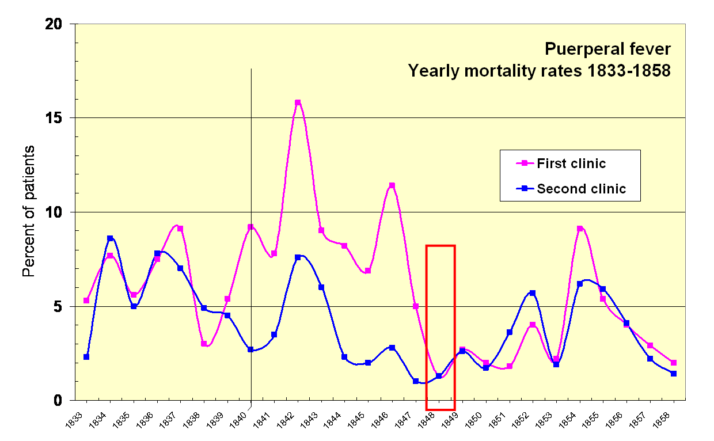

# Foundations of Epidemiology
{: .no_toc }

We are going to replicate one of the foundational studies in [Epidemiology](https://en.wikipedia.org/wiki/Epidemiology) and the closely related field of [Health Geography](https://en.wikipedia.org/wiki/Health_geography) using modern GIS techniques. Before we get into the doing the analysis, lets get some context behind why this is important.

**Note** This section covers **[question 7](Assessment.md#foundations-of-epidemiology)** in the module quiz

---

  

    Table of contents
  

  {: .text-delta }
1. TOC
{:toc}

---

# Miasma vs. Germ Theory

Early forms of [germ theory](https://en.wikipedia.org/wiki/Germ_theory_of_disease), the concept that disease transmission is driven by pathogens, emerged around the world more than 2000 years ago.  By the middle ages, Islamic physicians had formally proposed the basics of germ theory.  For example, writing about an outbreak of the bubonic plague in [1362](https://en.wikipedia.org/wiki/Ibn_al-Khatib#On_the_Plague), Ibn al-Khatib astutely pointed out:

* *"The existence of contagion is established by experience [and] by trustworthy reports on transmission by garments, vessels, ear-rings; by the spread of it by persons from one house, by infection of a healthy sea-port by an arrival from an infected land [and] by the immunity of isolated individuals."*  

Yet European physicians clung to the [miasma theory](https://en.wikipedia.org/wiki/Miasma_theory) for many centuries.  This theory attributed diseases such as cholera to “bad air”.  

## Hand Washing: An Early Case Study
{: .no_toc }

The Vienna Maternity Hospital had two clinics with vastly different maternal mortality rates.  Between 1840 and 1846, the maternal mortality rate was 10% at the "First" clinic but only 4% at the "Second" clinic run by midwives.
* The First clinic was run by physicians and medical students. 
  * They started each day with postmortem examinations.  They then proceeded to the maternity, **ward without washing their hands**, where the students did vaginal examinations as part of their training (Loudon, 2013).
* The Second clinic was run by midwives.
  * They generally had more sanitary practices (Varney & Thompson 2015) and they did not do postmortems or vaginal examinations (Loudon, 2013).
  * Consequently they tended to have lower mortality rates.

In 1847, the new chief resident Ignaz Semmelweis suspected contagions from the cadavers were to blame.  Semmelweis mandated hand washing and sanitizing instruments with a chlorine solution for both clinics.

* By 1848, the maternal mortality rate in both clinics fell to 1.3% (Loudon, 2013). 
* Despite the overwhelming evidence in favor of sanitizing, the practice was rejected by the European medical community because it was in conflict with the Miasma theory.
  *  Semmelweis' was replaced in 1849, sanitizing fell out of practice, and death rates began to rise again.

<!-- 

  <iframe src="content/images/ViennaHospital.png" title="Processes" scrolling="no" frameborder="0"
    style="border: 0;
   height: 90%;
   left: 0;
   position: absolute;
   top: 0;
   width: 90%;">
   
Your browser does not support iframes.

 </iframe>

 -->

<a href="content/images/ViennaHospital.png" target="_blank">View Image in New Tab</a>

# Belief Perseverance
In the face of mounting evidence many doctors and public officials stubbornly refused to acknowledge that basic hygiene and sanitation could save lives for decades because they were attached to the Miasma theory.

* Some were also offended by the idea that physicians themselves were vectors for disease transmission because [*"a gentleman's hands are clean"*](https://en.wikipedia.org/wiki/Charles_Delucena_Meigs).  

Rejection of sanitary practices in the European medical community is an example of [belief perseverance](https://en.wikipedia.org/wiki/Belief_perseverance).  Historically, this is a common issue that has impeded numerous scientific advancements (eg. plate tectonics, climate change, vaccines, etc).
  * Belief perseverance has many causes but it is often exacerbated by misogyny, racism, and ethnocentrism (eg. Rossiter 1993).

# Foundations of Epidemiology

[Dr. John Snow](https://en.wikipedia.org/wiki/John_Snow#Cholera) was a physician practicing in London where cholera outbreaks were a frequent occurrence due to poor sanitation practices.  Dr. Snow was a skeptic of the miasma theory and a proponent of germ theory.

* In 1849 he proposed cholera that it was spread by fecal contaminated water, after comparing cholera rates between London districts supplied by different water companies.

Five years later, during an outbreak in London's SoHo neighborhood in 1854, Dr. Snow was able to identify the point source of an the outbreak using a hand-sketched map.  

* He recorded each case of cholera in the area using a dash, and recorded each water pump with a circled dot, creating what today would be called a **dot map**.
  * By recording clusters of disease, and conducting interviews, Snow was able to trace most cases of the outbreak to a single water pump, located on Broad st.

Using his map, Dr. Snow was able to convince the local council to remove the pump handle and the outbreak subsided.

* Despite this, the medical community in London continued to reject the idea that Cholera was caused by fecal contamination for another twenty years.

<!-- 

  <iframe src="content/images/Snow_Map.jpg" title="Processes" scrolling="no" frameborder="0"
    style="border: 0;
   height: 100%;
   left: 0;
   position: absolute;
   top: 0;
   width: 100%;">
   
Your browser does not support iframes.

 </iframe>

 -->

<a href="content/images/Snow_Map.jpg" target="_blank">View Image in New Tab</a>

# References
{: .no_toc }

Loudon, I. (2013). Ignaz Phillip Semmelweis’ studies of death in childbirth. Journal of the Royal Society of Medicine, 106(11), 461–463. https://doi.org/10.1177/0141076813507844

Rossiter, M. W. (1993). The Matthew Matilda Effect in Science. Social Studies of Science, 23(2), 325–341.

Varney, H., & Thompson, J. B. (2015). A History of Midwifery in the United States. Springer Publishing Company. https://connect.springerpub.com/content/book/978-0-8261-2538-5