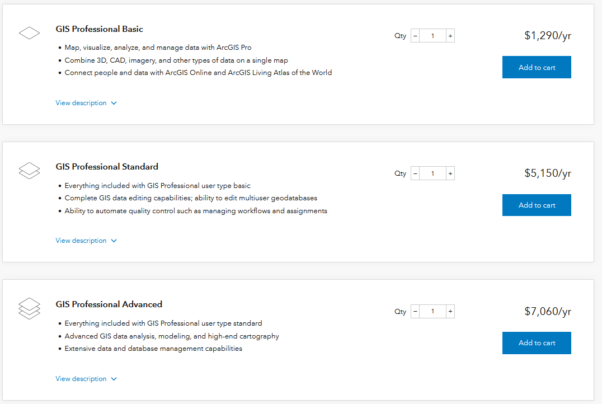

# Proliferation of GIS
{: .no_toc }

GIS has become a powerful, widely used tool for GIS in recent decades.

  

    Table of contents
  

  {: .text-delta }
1. TOC
{:toc}

---

# Proprietary GIS Software 

GIS is very much rooted in capitalism and the capitalist enterprise.  Consequently many of the initial developments in GIS were by for profit companies.  For example, [ESRI](https://www.esri.com/en-us/home) is a leading producer of GIS software.  They make ArcGIS Pro, the software package we will be working with most in this class.  

**Proprietary** software requires users to purchase a license in order to gain access and restricts access to source code, meaning users have no right to view or edit source code (inner workings of a program).  Common examples of proprietary technology include:
* Operating Systems: Windows OS, Mac OS, IOS
* Programming Languages: MATLAB, VBScript
* Software Packages: Microsoft Office (Word, Excel, Power Point etc.), Adobe Illustrator, IOS, ArcMap

Proprietary software licenses are often very expensive.  They pose a significant barrier to access for uses that aren't affiliated with large institutions.

## ArcGIS Pro
{: .no_toc }

---

# Open Source GIS

There are alternatives!  Open source software packages have proliferated in recent years and are a viable alternative to the traditional options.  The the internet has connected like-minded developers and allowed for collaboration across the globe.

**Open Source** software is free to use, published under an open copyright license.  Users have the right to view, edit, and distribute the source code.  Common examples of open source technology include:

* Operating Systems: Linux OS, Android
* Programming Languages: Python, R, Java, etc.
* Software Packages: Libre Office (Writer, Calc, Impress, etc.), Ink Scape, QGIS

Open source software is more accessible because its free to download and use.

## QGIS
{: .no_toc }

  <iframe src="https://www.qgis.org/en/site/" title="Processes" scrolling="no" frameborder="0"
    style="border: 0;
   height: 100%;
   left: 0;
   position: absolute;
   top: 0;
   width: 100%;">
   
Your browser does not support iframes.

 </iframe>

<a href="https://www.qgis.org/en/site/" target="_blank">View slides in new tab</a>

## Open Street Maps
{: .no_toc }

[Open Street Maps](https://www.openstreetmap.org/#map=10/49.2839/-122.8340&layers=T) is a freely available public database of geospatial information.

## Programming Languages
{: .no_toc }

Programming languages like Python and JavaScript can be used to conduct a variety of geospatial analysis and make webmaps.  I created the map below using JavaScript.  I'll talk a bit more about these methods later on in the term.

Webmap for navigating to UBC micromet field sites.

  <iframe src="https://ubc-micromet.github.io/FieldSiteMaps/" title="Processes" scrolling="no" frameborder="0"
    style="border: 0;
   height: 100%;
   left: 0;
   position: absolute;
   top: 0;
   width: 100%;">
   
Your browser does not support iframes.

 </iframe>

# Fremium Services

Companies like [mapbox](https://www.mapbox.com/mapbox-studio/) and google provide some geospatial services that are "free" to a point.  For example, [Google earth engine](https://code.earthengine.google.com/) provides its cloud based computational capabilities to non-commercial users free of charge. 

<iframe width="560" height="315" src="https://www.youtube.com/embed/gKGOeTFHnKY" title="YouTube video player" frameborder="0" allow="accelerometer; autoplay; clipboard-write; encrypted-media; gyroscope; picture-in-picture" allowfullscreen></iframe>
